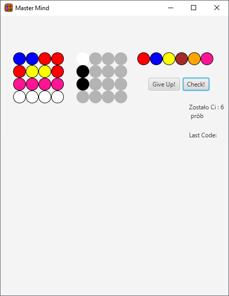
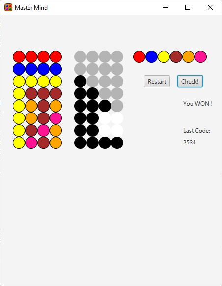

  

[![Contributors][contributors-shield]][contributors-url]
[![Forks][forks-shield]][forks-url]
[![Stargazers][stars-shield]][stars-url]
[![Issues][issues-shield]][issues-url]
[![LinkedIn][linkedin-shield]][linkedin-url]

<!-- PROJECT LOGO -->
 

  

<h3 align="center">Mastermind</h3>

  

    Mastermind game created with JavaFX.
     
    <a href="https://github.com/Remigiusz-Gabryel/Mastermind"><strong>Explore the docs</strong></a>
     
     
    <a href="https://github.com/Remigiusz-Gabryel/Mastermind">View Demo</a>
    ·
    <a href="https://github.com/Remigiusz-Gabryel/Mastermind/issues">Report Bug</a>
    ·
    <a href="https://github.com/Remigiusz-Gabryel/Mastermind/issues">Request Feature</a>
  

<!-- TABLE OF CONTENTS -->

  
Table of Contents

  <ol>
    <li><a href="#about-the-project">About The Project</a></li>
    <li><a href="#features">Features</a></li>
    <li><a href="#screenshots">Screenshots</a></li>
    <li><a href="#roadmap">Roadmap</a></li>
    <li><a href="#acknowledgments">Acknowledgments</a></li>
  </ol>

## About The Project
 Game about breaking the code. Can You do it ? 

(<a href="#readme-top">back to top</a>)

## Features

(<a href="#readme-top">back to top</a>)

## Screenshots

 
 
 

(<a href="#readme-top">back to top</a>)

<!-- ROADMAP -->
## Roadmap

- [ ] Add Changelog
- [ ] Add Difficulty level 
- [ ] Add background colors

See the [open issues](https://github.com/Remigiusz-Gabryel/MasterMindGame/issues) for a full list of proposed features (and known issues).

(<a href="#readme-top">back to top</a>)

<!-- ACKNOWLEDGMENTS -->
## Acknowledgments

Resources I would like to give credit to. 

* [Best-README-Template](https://github.com/othneildrew/Best-README-Template)

(<a href="#readme-top">back to top</a>)

<!-- MARKDOWN LINKS & IMAGES -->
<!-- https://www.markdownguide.org/basic-syntax/#reference-style-links -->
[contributors-shield]: https://img.shields.io/github/contributors/Remigiusz-Gabryel/Mastermind.svg?style=for-the-badge
[contributors-url]: https://github.com/Remigiusz-Gabryel/Mastermind/graphs/contributors
[forks-shield]: https://img.shields.io/github/forks/Remigiusz-Gabryel/Mastermind.svg?style=for-the-badge
[forks-url]: https://github.com/Remigiusz-Gabryel/Mastermind/network/members
[stars-shield]: https://img.shields.io/github/stars/Remigiusz-Gabryel/Mastermind.svg?style=for-the-badge
[stars-url]: https://github.com/Remigiusz-Gabryel/Mastermind/stargazers
[issues-shield]: https://img.shields.io/github/issues/Remigiusz-Gabryel/Mastermind.svg?style=for-the-badge
[issues-url]: https://github.com/Remigiusz-Gabryel/Mastermind/issues
[linkedin-shield]: https://img.shields.io/badge/-LinkedIn-black.svg?style=for-the-badge&logo=linkedin&colorB=555
[linkedin-url]: https://www.linkedin.com/in/remigiusz-gabryel
